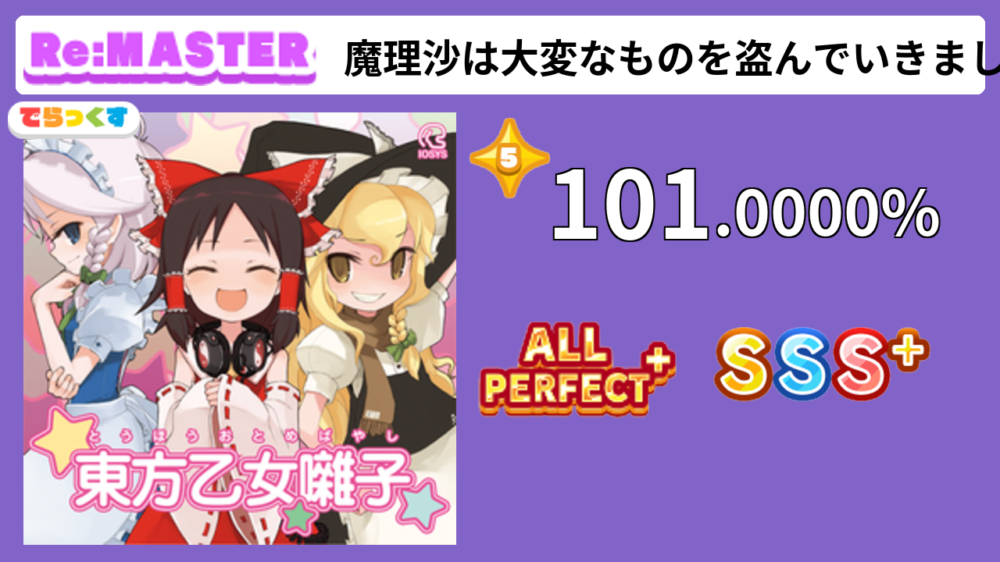
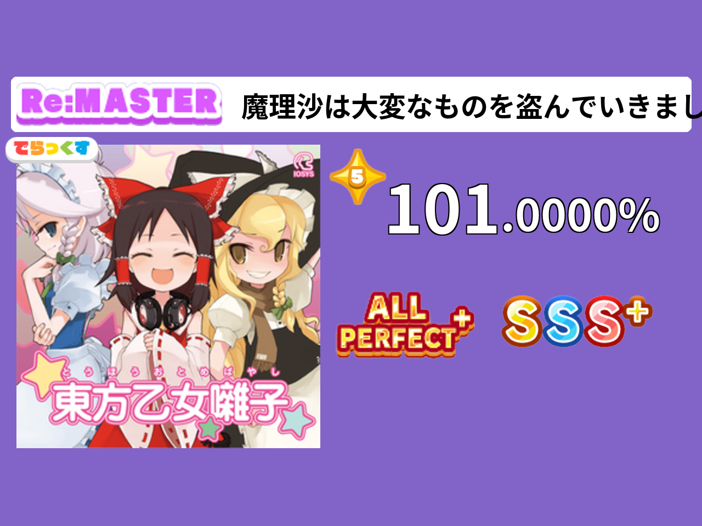

# 舞萌DX成绩图生成器

## 使用场景
- 手元视频封面

## 使用方法:
- 前往 [RELEASE](https://github.com/KirisameVanilla/MaimaiScorePicGenerator/releases) 页面, 根据版本顺序, 下载最新的 *MaimaiScorePicGenerator.exe*, *assets.zip*, *bgs.zip*
- 将两个zip解压
- 将exe文件和两个zip解压后的结果放在同个目录下, 文件夹结构如下
  ```
  my_folder
    |- MaimaiScorePicGenerator.exe
    |
    |- bgs
    |   |- 『ウソテイ』 ～一回戦せりなvsしろなvsなずな～.jpg
    |   |- Others
    |
    |- assets
        |- ap.png
        |- Others
  ```
- 运行 *MaimaiScorePicGenerator.exe*

## 图例
### 16:9比例

### 4:3比例
